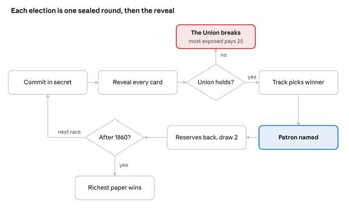

# The Fourth Estate — Game Design Document (Draft)

## Overview

The Fourth Estate is a sealed-bid card game about the partisan press, 1796 to 1860: you run the news to decide who wins the White House, or bury it for money. The richest paper after {{n_races_word}} elections wins.

| Vector | Description |
| --- | --- |
| Players | 1 to 5; solo play is one human against 1 to 4 rival papers (bots, Easy or Hard) |
| Length | {{n_races}} rounds, one per election; a 14-round solo playtest ran 8 minutes (game 29) |
| Win condition | Most money at the end; money comes only from burying stories |

**The action economy.** Every story in your hand faces one decision: run it positive to promote a candidate, run it negative to attack his opponent, or bury it for profit. The two candidates in every race stand on one binary: federal power or state power. The paper with the most influence on the winner becomes the Patron for the next election, and the Patron reaps the reward: every story it buries pays double.

**The tension on top.** A negative story is the strongest push a paper has, but it wears down the Union, and so does every election that goes against history. If the Union breaks, the game ends at once and the most exposed paper pays for it.

## Components

| Component | What it is | Numbers |
| --- | --- | --- |
| The board | {{n_races_word_cap}} presidential races, 1796 to 1860, each a Nation candidate against a States candidate | Every election in the period, including the near-walkovers of 1804, 1816 and 1820 |
| The track | States' rights on the left, federal power on the right; starts level every round | −5 to +5 |
| The Union | A shared stability gauge; negative stories and bent history wear it down | 10 per two seats, recovers 1 per two seats each election |
| The deck | Newspaper stories, released as their events happen | {{n_cards}} stories: {{n_event}} news stories, {{n_profit}} trade stories |
| The purse | Each paper's money, the only score | 12 to start |
| The hand | Stories held between rounds | 5 to start, draw 2 a round, limit 10 |

The seventeen races: 1796, 1800, 1804, 1808, 1812, 1816, 1820, 1824, 1828, 1832, 1836, 1840, 1844, 1848, 1852, 1856, 1860. The Nation candidate is the one with the stronger federal-power record (Adams, Pinckney, Clinton, King, J.Q. Adams, Clay, Harrison, Taylor, Scott, Frémont, Lincoln); history elected him in {{n_nation_wins}} of the {{n_races}}. In 1820 Monroe ran unopposed, so the Nation side is John Quincy Adams, who got a single elector's protest vote. Every race is listed in Appendix A.

## Stories

Every story carries up to three numbers, and what you do with it decides which one counts.

- **Bury it** for its **profit**: the money goes straight to your purse. This is the only way to score.
- **Run it positive**: a favourable story, pushing the track toward the side it helps (1 to 3) and counting that much influence on that side's candidate.
- **Run it negative**: a hostile story, pushing the other way, and always **harder** than the same story run positive. It also costs the Union its **stability** number. A story touches stability only when it is run negative.

On the table, a story dropped on a candidate runs whichever way pushes toward him. Positive and negative always point opposite ways, so exactly one fits each candidate. The foot of every story is printed in table order: States push, profit, Nation push.

| Story | Year | Profit (bury) | Positive story | Negative story | Stability cost |
| --- | --- | --- | --- | --- | --- |
{{example_rows}}

**Two kinds.** {{n_event}} news stories argue; {{n_profit}} trade stories are the business of the press itself (the first American daily, the Postal Act, Niles' Register, the penny press, the telegraph, the Associated Press, the rotary press, cheap postage). Trade stories push nobody: they can only be buried.

**Dated release.** A story enters the deck at the first campaign held in or after its year. The deck opens on the {{n_opening}} stories up to 1796, from the Stamp Act to the Jay Treaty; each later campaign adds the news since the last. Stories never leave the deck. Every story is listed in Appendix B.

**The balance rule.** Within every one of the {{n_races}} release batches, the Nation push on offer equals the States push on offer, counting both the positive and the negative run of every story, and on every story the negative push is the larger. The simulator refuses to run if either rule breaks.

## A round

Each election is one round: every paper commits in secret, then every story is revealed at once and the election resolves.

1. **Commit.** Decide each story you want to use this round: run it positive, run it negative, or bury it. Commit as many as you like, or none and pass. At most one story a round may run negative. Star one story you ran as your reserve.
2. **Reveal.** Buried stories pay now, doubled for the sitting Patron. Every push is added to the track, capped at ±5. Negative stories are charged to the Union.
3. **The Union.** At zero stability the Union breaks and the game ends here (see The Union).
4. **The election.** The side the track leans toward wins. A level track goes to the greater total influence; if that is level too, to the historical winner. A winner history did not elect costs the Union 2 per two seats.
5. **The Patron.** The single largest influence on the winner makes that paper Patron until the next election; a tie leaves nobody Patron.
6. **Clean-up.** Everyone but the new Patron takes back its reserved story; every other story committed is spent. Everyone draws 2, the Union recovers 1 per two seats, and the next race's news enters the deck.

## The Union

The Union is a shared gauge every paper can spend and nobody owns: it starts at 10 per two seats and ends the game the moment it hits zero.

| What moves it | Amount |
| --- | --- |
| A story run negative | minus its stability cost (1 to 3) |
| An election won by the man history did not elect | minus 2 per two seats, charged before recovery |
| Each election survived | plus 1 per two seats, never above the ceiling |

**Exposure.** Every negative story a paper runs adds 1 to its public exposure, ranked across the table (1 = most exposed). If the Union breaks, the game ends where it stands, the most exposed paper loses 25 (ties all pay), and the richest paper after that wins.

**Guard rails.** Only one negative story per paper per round. Without that cap, one paper flooding negative stories broke the Union in 80 to 100% of simulated games; with it and the current settings, careful play breaks the Union in about 1% of heads-up games and 11 to 25% of games at three to five seats. A paper that runs a negative story every round breaks it almost every time, but it carries the exposure, pays the 25 and loses.

The gauge sits in the status bar and on the table; a commitment that would make you the most exposed paper, or push the Union near zero, is flagged before you seal it.

## Winning and scoring

Money is the only score, and the only money comes from burying stories; elections pay nothing directly.

- **Normal end:** after the 1860 election, the richest paper still playing wins.
- **Early end:** if the Union breaks, the game stops that round; the most exposed paper loses 25, then the richest wins.
- **Why elections matter anyway:** the Patron's buried stories pay double for a round, and that doubled round is where games are won. In playtest 31 the winner's seven Patron rounds paid 36, 16, 26, 30, 32, 24 and 48: 212 in all, every coin earned that game (224 less the 12 starting money).
- **Ties:** equal money goes to the lower seat; a conceded paper cannot win.

Final scores go to the lobby's circulation board, per variant, and every game can be exported as a full log for review.

## Opponents

Solo players choose Easy or Hard rival papers in the lobby; Hard is the winning human strategy from the playtests, written down as rules.

| | Easy | Hard |
| --- | --- | --- |
| As Patron | Buries stories at double, keeping four in hand | Buries its whole hand at double, keeping one cheap story back for the next bid |
| Otherwise | Runs any story whose push is at least its profit, for the side its hand favours; buries the rest | Wins the Patronage as cheaply as the table allows: influence 1 if every rival is the sitting Patron (who will be burying), else 2; holds everything else. Buries its whole hand in the final election |
| Negative stories | One a round, only while stability stays above 4 per two seats | One a round, only while stability stays above 5 per two seats |
| Heads-up vs Easy | — | wins 100% |
| Vs the human line from games 29 and 31 | wins under 1% | wins 62% |

**How Hard was derived.** The logs of playtests 24, 29 and 31 (all won by the human: 162–150, 170–159, 224–152) show one pattern: take the Patronage with one cheap story, often negative, then bury nearly the whole hand at double. That line was coded as a test player, then Hard was tuned against it in the simulator (keep 1 story as Patron, a bid cushion of 1, bury everything in the final election).

Bots decide from a public view of the table only: every sealed commitment is removed before they choose. Their caution about the Union scales with the table, because in a sealed round every rival may be running a negative story at the same moment.

## Balance

Every tuned number was set by the simulator (tools/simulate.py, 400 to 1,000 games per setting), which reads the stories straight from the game's data file so the two cannot drift.

| Setting | Value | What the simulation showed |
| --- | --- | --- |
| Reserve | Stories run, never stories buried | When any story could be reserved, a paper that only buried replayed its best profit story every round and beat the bot 99.8%; now it wins under 1% heads-up |
| Patron reward | Buried stories pay ×2 the next round | ×1 left running stories worthless; ×3 made a bury-only paper hopeless |
| Negative stories | 1 per paper per round | Uncapped, one paper broke the Union in 80–100% of games |
| Negative push | Always stronger than the same story's positive push | A paper that never runs a negative story now loses to the bot 97% heads-up: negative stories matter |
| Stability | 10 per two seats, +1 per two seats each election | At 14 and +2, recovery refunded every negative story and the gauge never moved |
| Bot caution | Stay above 4 (Easy) or 5 (Hard) per two seats | A fixed margin let every bot run a negative story in the same sealed round, breaking the Union in 98–100% of four- and five-seat games; scaled, 20–25% |
| History shock | −2 per two seats | Careful play breaks the Union in 1 / 11 / 20 / 25% of games at 2 / 3 / 4 / 5 seats; a shock of 3 broke far more |
| Exposure penalty | 25 | The smallest penalty with the full deterrent effect; higher punished no more |
| Track | Resets to level each election | A carried-over track decided 67% of races at ±5 before anyone played |
| Passing | Allowed | No passing line beat a fair share (pass until 6 stories: 19% heads-up) |
| Story balance | Nation push = States push in every release batch | Nation wins ~34% of races before 1848 (level races go to history, which mostly chose the States man) and ~49% after |

Turn order was removed entirely by sealed rounds, so there is no first-player advantage to tune. The Patron almost never repeats: the Patron buries rather than bids, which is a built-in brake on a runaway leader.

## Playtest record

Four human games have been played and exported; the human won every finished one, and each shaped a change.

| Date | Game | Table | Result | What it showed | What changed |
| --- | --- | --- | --- | --- | --- |
| 2026-09-27 | 31 | 1 human, 1 Easy bot | Won 224–152 | Seven Patronages; every coin came in Patron rounds; four races where nobody ran a story | Hard bot built from this line; Easy kept |
| 2026-09-27 | 29 | 1 human, 1 Easy bot | Won 170–159 | The Patronage ping-ponged uncontested, taken with one cheap (often negative) story; the Union fell to 4 of 10 | Bot weakness confirmed; an "incumbent Patron" rule proposed |
| 2026-09-27 | 24 | 1 human, 2 Easy bots | Won 162–150–138 | Holding the hand while not Patron, then burying it all as Patron, beat the bots at every table size in simulation | First evidence for the Hard bot |
| 2026-09-26 | 19 | 1 human, 1 Easy bot | Unfinished, 76–100 after 5 rounds | Rules checked correct round by round; exported stake logs were ambiguous | Influence now logged as seat and amount pairs |

Every game replayed cleanly from its log: payouts, Patrons, reserves and the one-negative-story limit all matched the rules. All four were played before negative stories became the stronger push and before 1804, 1816 and 1820 returned.

## Interface and presentation

The screen is a newspaper office on one desktop page, in the visual language of The Historians: deep teal, cream parchment, gold hairlines, oxblood for danger.

| Element | What the player sees |
| --- | --- |
| The table | Three drop zones: the States candidate (oxblood), "Bury it", where stories are killed for their profit, the Nation candidate (federal blue); drag a story, or tap it then tap a zone |
| The desk | Your hand of stories, laid out on parchment across a wooden desk: dateline, headline, flavour, and a foot of three numbers in table order |
| The temper of the nation | A tug-of-war gauge: where each past election landed, the last one in gold, and a dashed marker for where your own commitment would push |
| The returns | After each election, a parchment broadsheet: "The returns of 1800", the track, the Patron, what the Union lost, every paper's stories |
| The status bar | Election, the Union's gauge, your purse, who is in office and his Patron |
| The side | The presses (every paper's money, Patronages, exposure) and the wire (the event log) |

**Type and colour.** Cormorant Garamond for display, Spectral for text, JetBrains Mono for small tracked labels; square corners; States always oxblood, Nation always federal blue.

**Fit.** On a desktop the whole game fits one screen (checked at 1440 × 900 and 1366 × 768); panels fold behind a caret to a one-line summary. Phones scroll.

## Open questions and next steps

The biggest open question is whether the Patronage should be fought over more; everything else is refinement.

- [ ] **Incumbent Patron.** Keep the Patronage until someone beats the influence it was won with, turning the ping-pong seen in playtests into a bidding war. Needs a simulation before any change.
- [ ] **Heads-up ties.** Nearly half of two-player races end level with equal influence and go to the historical winner; consider a different tie-break.
- [ ] **Old news.** Stories never leave the deck, so founding-era stories are still drawn in the 1850s; retiring stories 20 years after their date cut that share to ~15% in simulation.
- [ ] **Carrying the lean.** The track resets every election; a partial carry-over (say half) would make the nation's mood persist. A full carry pinned races at ±5.
- [ ] **Bigger tables.** Four and five seats are simulated but not yet playtested by people.
- [ ] **Multiplayer in the lobby.** The server seats several humans, but the lobby only opens solo tables.
- [ ] **Historical review.** Every story's numbers and every candidate's side are a first draft worth an expert read.
- [ ] **Playtests against Hard.** No human game has been played against the Hard bot, or with stronger negative stories, yet.

## Decision log

The game has been rebuilt twice since its first version; the log below runs newest first.

| Date | Decision | Why |
| --- | --- | --- |
| 2026-09-27 | Negative stories are always the stronger push; three new stories (the Burr Conspiracy, the Crawford Radicals, the Free Soil Party) balance the batches that could not; bot caution scales with table size | A negative story should be the powerful move, paid for in disunion. Union breaks among bots: 1 / 11 / 20 / 25% at 2–5 seats |
| 2026-09-27 | 1804, 1816 and 1820 restored: seventeen elections; Hard buries everything in the final election and bids to 2 | Every election in the period on the board; Hard kept ahead of the human line over the longer game |
| 2026-09-27 | Easy and Hard bots | The human beat the only bot 224–152 |
| 2026-09-27 | One-page desktop layout with folding panels | The board, zones and hand had to scroll |
| 2026-09-27 | The temper-of-the-nation gauge | No picture of where the country stood between the two sides |
| 2026-09-27 | Redesign in The Historians' visual language; drag-and-drop table | The old screen read like a spreadsheet |
| 2026-09-27 | Bent history costs the Union 2; ceiling 10 | At 14 the Union never felt at risk |
| 2026-09-27 | Passing a round allowed | No passing line beat a fair share |
| 2026-09-27 | Exposure: the most exposed paper pays 25 when the Union breaks | "Everyone loses" let one paper wreck the game |
| 2026-09-27 | Three numbers per story; money only from burying; Patron ×2; one negative story a round; reserve limited to stories run | Each story now argues both ways; every batch push-balanced |
| 2026-09-26 | Sealed rounds: one blind commitment per election | Removed turn order and its seat bias |
| 2026-09-26 | Stories released by date; 40 new founding and press stories | Events should arrive when they happened |
| 2026-09-26 | v2: one Nation/States track, stories reduced to two numbers | v1's three tracks, key cards and stability were too much to learn |
| 2026-08-24 | v1 rules engine and simulator | First playable version |

## Appendix A: The presidential races

All {{n_races_word}} races on the board. History elected the Nation candidate in {{n_nation_wins}} and the States candidate in {{n_states_wins}}.

{{appendix_races}}

## Appendix B: The stories

All {{n_cards}} stories in date order. "Enters" is the election whose campaign first shuffles the story into the deck. A negative story costs the Union the stability shown; trade stories can only be buried.

{{appendix_cards}}
